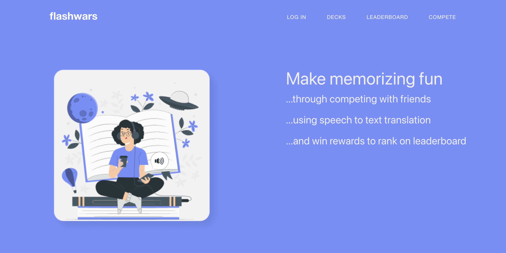
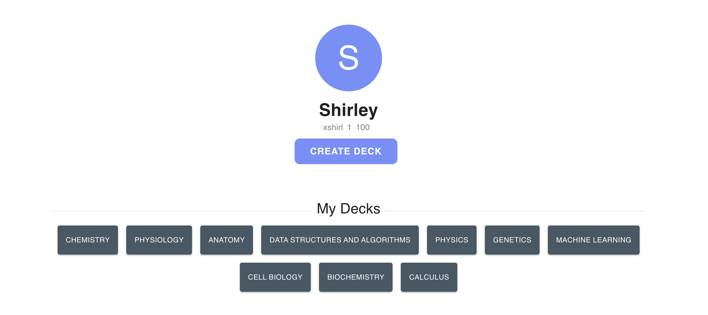
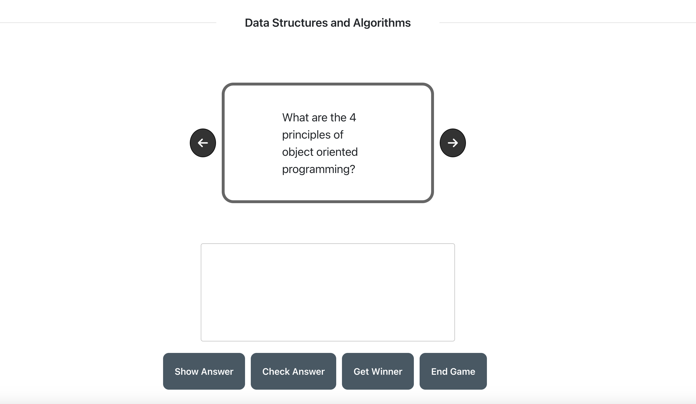

# Flashwars Application

### A MERN application that uses socket.io to support real-time multi-user interactivity. 

Flashwars is an application that aims to improve the quantitative measurement of a user's accuracy of retaining and remembering information. 

Features:
- quantative analysis of user's accuracy
- real time multiple-user interactivity 
- speech to text translation





### Database Schema 


### MVC Architecture 

```
signUp
signIn
verifyUser

userProfile
updateUserPoints
getLeaderBoard

getDeck
getAllDecks
getUserDecks
deleteDeck

getFlashcard
createFlashcard
editFlashcard
deleteFlashcard

```
